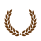
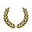
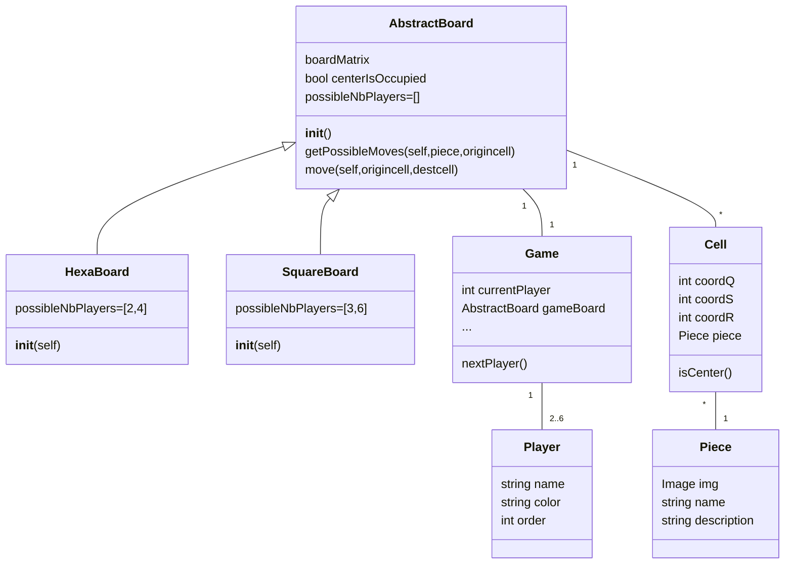

[](https://forthebadge.com)

# Djambi Project

## Assets

| Chief                                     | Assassin | Diplomat | Necromobile| Reporter                                     | Militant | Crown |
|:------------------------------------------|:---------|:---------|:------------|:---------|:---------------------------------------------|:-------|
|  | || | |           |           | 
|  | || | |           |            |
|  | || | |           |            |
|  | || | |           |            |
|  | || | |           |            |
|  | || | |           |            |
|  | || | |           |          |


## Structure



## Make Commands

### Run game

```shell
make
```

### Install requirements 

```shell
make requirements
```

### Generate colorized assets 

```shell
make colorize-pieces 
```
