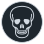
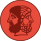
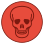
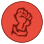
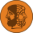
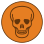
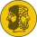
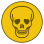
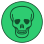
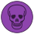

[](https://forthebadge.com)
# Djambi Project

## Assets

| Chief                                     | Assassin | Diplomat | Necromobile| Reporter                                     | militant | 
|:------------------------------------------|:---------|:---------|:------------|:---------|:---------------------------------------------|
|  | || | |           | 
|  | || | |           | 
|  | || | |           | 
|  | || | |           | 
|  | || | |           | 
|  | || | |           | 
|  | || | |           | 


## Make Commands

### Run game

```shell
make
```

### Install requirements 

```shell
make requirements
```

### Generate colorized assets 

```shell
make colorize-pieces 
```
